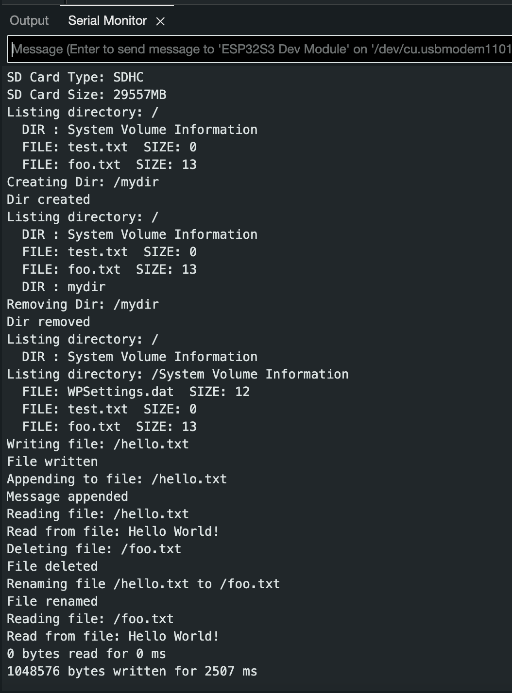

# Playing Music on a Speaker from SD Card (Team 9 Fall 2024)

## Introduction

This tutorial aims to let others recreate one of the many steps from our project. Our group followed these steps in order to figure out some parts to the hardware side of our device. The integration of the SD card and speaker was done through thorough testing and this tutorial happens to be one of the tests done for the project. Our goal is for readers to learn how to test a speaker and amplifier, as well as integrate an SD card adapter to play an MP3 file through the speaker.

### Learning Objectives

- Understand the basics of speaker and amplifier functionality and how to test them
- Learn how to connect and configure an SD card adapter for audio playback
- Gain hands-on experience with hardware integration and troubleshooting techniques
- Develop the ability to play MP3 files through a speaker using an SD card adapter
- Apply systematic testing methods to ensure proper functionality of connected components
- Build foundational knowledge of audio device assembly and configuration for similar projects


## Getting Started


### Required Downloads and Installations

[Arduino IDE](https://www.arduino.cc/en/software): IDE needed for microcontroller of use.


### Required Components

List your required hardware components and the quantities here.

| Component Name | Quanitity | Notes |
| -------------- | --------- | ----- |
| Small Speaker  |1          | For audio output. Ensure it matches the amplifier specifications.
| Amplifier      |1          | To amplify the audio signal from the microcontroller.
| Breadboard     |1          | For prototyping the circuit connections.
| Jumper Cables  |Several    | To connect the components on the breadboard.
| Buttons        |2          | For controlling playback or other functionalities.
| SD Card        |1          | To store MP3 files for playback.
| SD Card Adapter|1          | For interfacing the SD card with the microcontroller.
| Microcontroller (ESP32-S3)|1| A powerful microcontroller with built-in Wi-Fi and Bluetooth support.
| USB-C cable    | 1         | To supply power to the microcontroller and upload code.

### Required Tools and Equipment

Computer, Soldering station, and Wire stripper.

## Part 01: Speaker Testing

### Introduction

We will be testing the functionality of the speaker.

**Here is a video clip of what the results of the test should look like for the speaker and amplifier:**

[Speaker Example Video](https://youtube.com/shorts/FYhkYiKPkjs?feature=share)

### Objective

- Learn how to set up a basic circuit to connect the speaker to the microcontroller.
- Understand how to install and use an audio library in the Arduino IDE.
- Configure the microcontroller to generate audio signals for the speaker.
- Test the speaker by playing simple audio output (e.g., tones or basic sound effects).


### Components

All of the components needed for part 1 are listed above. The SD Card adapter and SD Card will be used in part 2 of this tutorial.

### Instructional Steps

**Step 1: *Upload Appropriate Library***

You'll need to install the ESP8266 Audio Arduino Library, written by Earle F. Philhower, which you can get from the link below. This library will allow you to play a wide variety of audio formats including: AAC, FLAC, MIDI, MOD, MP3, RTTTL, and WAV. To use the library, you can add the library from Arduino by selecting Sketch ** > **Include Library ** > **Add .ZIP Library... and selecting the .zip file from wherever you store your file downloads.

Link to library: https://github.com/earlephilhower/ESP8266Audio/archive/master.zip

**Step 2: *Establish Correct Pins***

In this first example, we'll run a quick example sketch to make sure the amplifier and speaker are wired correctly and are working.


| Pin Label | Description                                                                                       |
|-----------|---------------------------------------------------------------------------------------------------|
| LRCLK     | Frame clock (left/right clock) input.                                                             |
| BCLK      | Bit clock input.                                                                                  |
| DIN       | Serial data input.                                                                                |
| GAIN      | Gain setting. Can be set to +3/6/9/12/15dB. Set to +9dB by default. WILL NOT BE USED.                        |
| SD        | Shutdown and channel select. Pull low to shutdown, or use the jumpers to select the channel output.|
| GND       | Connect to ground                                                                                 |
| VDD       | Power input. Must be between 2.5 and 5.5VDC. 
|+|Positive speaker output.
|-|Negative speaker output.

Speaker wires can be directly soldered onto the output pads of the amplifier but you can also use the screw terminals which are included with the amplifier. Now solder on header pins to the amplifier.

Here is an example video on how to do that: 

[Solder Video Here (Watch up to 11:20 if you are a beginner)](https://www.youtube.com/watch?v=Z7AyhDo_gN4&ab_channel=nLab)

Now grab some jumper cables and connect the female part of the jumper cable to the header pins on the amplifier. Now make connections to the breadboard and power up the amplifier (only GND and VDD). With the rest of the pins from the amplifier, make connections to the ESP 32 with the male ends of the cables. 

Here are the pin conections you should make:

| Pin Label | Pin Connection                                                                                       |
|-----------|---------------------------------------------------------------------------------------------------|
| LRCLK     | pin 39                                                            |
| BCLK      | pin 38                                                                                  |
| DIN       | pin 37                                                                                |
| GAIN      | VDD                        |
| SD        | VDD |
| GND       | Connect to ground                                                                                 |
| VDD       | Must be between 2.5 and 5.5VDC. 


***Step 3: Code for Speaker***

Having the appropriate library installed from step 1, we will now change the code a bit to match the pin values we used to wire up the adapter to the ESP-32 from step 2.

Steps to access the code:
1. On the menu bar, click on "File" on Arduino IDE.
2. Examples < (scroll to bottom) ESP8266Audio < PlayACCFromPROGMEM (This will be the code used to generate sound output)
3. Open file system < Documents < Arduino < Libraries < ESP8266AudioI2S.cpp (This will be the code that contains pin assignments)
4. Open the cpp file and make these changes on *lines 49 - 51* : `bclkPin = 38;` `wclkPin = 39;` `doutPin = 37;`
5. Save changes.
6. Go back to *PlayACCFromPROGMEM.ino* and comment out line 21: `// out = SetGain(0.125)` 

7. Upload to ESP-32.

Congrats! You should now hear Homer Simpson talk about the laws of thermodynamics on your speaker! Press on the 'Reset' button on the ESP-32 to replay the sound. 


## Part 02: SD Card Testing

### Introduction

Here, we will now separately test the SD card.

### Objective
- Verify the connection between the SD card adapter and the microcontroller.
- Test the ability to read and write files on the SD card.
- Load an MP3 file onto the SD card and confirm it can be read and processed by the ESP-32.
- Understand how to integrate SD card functionality with the audio playback system tested earlier in Part 01.


### Components
The components needed for this part are:

- SD Card
- SD Card Adapter
- ESP-32 Microcontroller
- Breadboard and Jumper Cables


### Instructional Steps
***Step 1: Wiring the SD Card Adapter***

Connect the SD card adapter to the ESP-32 microcontroller. Ensure that you follow the pinout diagram provided for the SD card adapter. 

Here are the typical connections:
| Pin Label | Pin Connection to ESP-32                                                                                       |
|-----------|---------------------------------------------------------------------------------------------------|
| SLK     | pin 14                                                           |
| MISO      | pin 12                                                                                  |
|MOSI| pin 13
|CS | pin 15

***Step 2: Formatting and Loading MP3 Files***

Copy an mp3 file to the SD card. Ensure the file is named "TRACK0".mp3 for easy access in the code.

***Step 3: Changing Code to Reassign Pins***

1. Go to file < Examples < SD < SD_Test
2. On lines 48-51, change the pins to match what we have on our physical ESP 32 connections. (Refer to table above)
3. Save changes.
4. On top right corner in Arduino IDE, click on the little magnifying bar. That will open the serial monitor.


***Step 4: Testing the SD Card through Serial Monitor on Arduino IDE***

1. Go to tools < USB CDC on Boot: Disabled" < Enabled (This is to be able to see print statements in the serial monitor)
2. Upload the SD_Test code to the ESP-32 using Arduino IDE.

You should see this in the serial monitor if successful:


## Part 03: Combining Speaker and SD Card

1. Go to file < new sketch
2. Copy and Paste the code provided to Arduino IDE:

```cpp
/****************************************************************
* PLAY MUSIC STORED ON SD CARD THROUGH AMPLIFIER
* ==============================================
*
* In this program MP3 compatible music file is stored on microSD
* card. The program opens the file and plays the music on the
* speaker through the MAX98357A amplifier
*
* Author : Dogan Ibrahim
* Program: SDMusic
* Date : April, 2023
**************************************************************/
#include "Arduino.h"
#include "Audio.h"
#include "SD.h"
#include "FS.h"
//
// microSD card to ESP32 connections
//
#define CARD_MOSI 13;
#define CARD_MISO 12;
#define CARD_SCK 14;
#define CARD_CS 15;
//
// Define MAX98357A amplifier connections
//
#define I2S_BCLK 5 //change to pins 38, 39 and 37? used for speaker test...
#define I2S_LRC 4
#define I2S_DOUT 6
Audio audio; // Audio object
void setup()
{
// CS is output
pinMode(CARD_CS, OUTPUT); digitalWrite(CARD_CS, HIGH); // CS HIGH
SPI.begin(CARD_SCK,CARD_MISO,CARD_MOSI); // Init SPI bus
Serial.begin(115200); // Serial Monitor
if(!SD.begin(CARD_CS)) // Start SD card
{
Serial.println(F("Error in microSD card")); while(true);
// card error

//Practical Audio DSP Projects with the ESP32
}
Serial.println(F("microSD card accessed correctly"));
audio.setPinout(I2S_BCLK, I2S_LRC, I2S_DOUT); // Setup I2S
audio.setVolume(10); // Set volume
audio.connecttoFS(SD,"TRACK0.mp3"); // Open file
}
void loop()
{
audio.loop();
}`
```

### Useful links

[Arduino Documentation](https://docs.arduino.cc/libraries/sd/): Comprehensive guide for programming sd card with Arduino.\
[ESP32-S3 Datasheet](https://www.espressif.com/sites/default/files/documentation/esp32-s3_datasheet_en.pdf): Detailed specifications for the microcontroller.\
[Original Audio Hookup Guide](https://learn.sarkfun.com/tutorials/i2s-audio-breakout-hookup-guide/all): Original source used for this tutorial.\